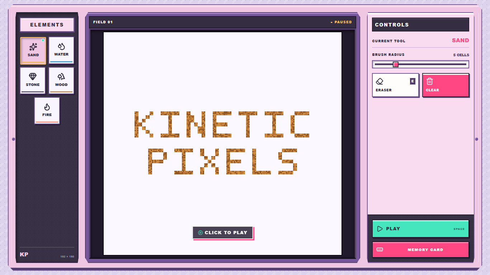
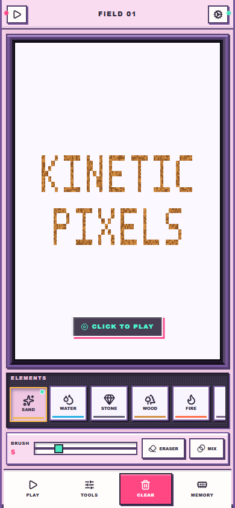
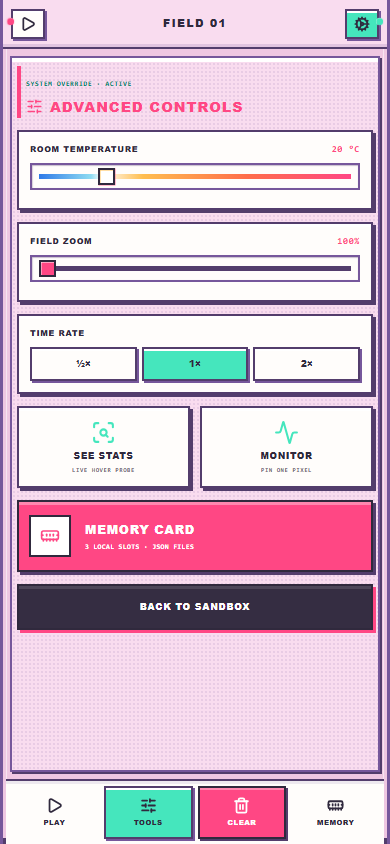

# Kinetic Pixels

**[Play the live build →](https://jeremyflim.github.io/kinetic-pixels/)**

Kinetic Pixels is a solo project—a deterministic, browser-only pixel-physics sandbox presented as a
pink-and-lavender molded-plastic console. Its 192 × 180 world starts with a wooden title made
from ordinary simulation cells: pour Sand over it, redirect Water through it, inspect its
temperature, erase it, or set it on fire.



The project combines a React interface with a framework-independent TypeScript simulation core,
a dedicated Web Worker, `OffscreenCanvas` rendering, versioned local saves, deterministic
randomness, and automated browser deployment. It has no server, accounts, analytics, or
automatic saving.

## Deliberately designed for desktop and mobile

The phone interface is a purpose-built interaction layout, not a scaled-down desktop. The canvas
remains the primary surface, Elements becomes a horizontally scrollable tray, frequent drawing
controls stay within thumb reach, and lower-frequency settings move into a dedicated Advanced
Controls screen. Both layouts operate the same live world, worker, tools, and save system.

<p align="center">
  
  &nbsp;&nbsp;
  
</p>

The responsive layouts are covered by browser behavior tests and pixel-level visual baselines at
360 × 640 and 390 × 844, alongside the desktop viewport suite.

## Engineering highlights

- **Responsive simulation loop:** the canonical world, fixed-step physics, and rendering run in
  a dedicated module worker, keeping high-frequency grid updates out of React. A bounded work
  budget yields during overload instead of stacking long catch-up bursts.
- **Dirty-region rendering:** one persistent pixel buffer caches the last visible cell state,
  recolors only explicitly dirtied 16 × 16 tiles, and uploads merged regions; unchanged frames perform no
  canvas upload.
- **Sleeping simulation tiles:** separate movement, thermal, moisture, electrical, and visual
  activity masks keep settled regions out of hot loops while one-tile halos preserve propagation.
- **Compact deterministic state:** parallel typed arrays store material identity, per-cell
  material state, electrical charge, temperature, moisture, fuel, liquid mass, phase progress,
  status, and update bookkeeping. A serialized xorshift PRNG makes equal seeds and commands
  reproducible.
- **Data-driven materials:** stable numeric IDs point to one physical-properties table covering
  movement, density, thermal behavior, electrical conductivity, ignition sensitivity, phase transitions, combustion, moisture,
  corrosion, and blast resistance.
- **Grounded physics with explicit game tuning:** heat exchange conserves energy and respects
  relative material properties, while documented calibration factors keep boiling, ignition,
  and other interactions playable.
- **Portable persistence:** three local slots and validated JSON exports use a versioned format;
  save versions 2–5 migrate into the current version 6 model.
- **Purpose-built responsive interface:** the desktop molded-console layout becomes a compact
  handheld layout on phones, with a horizontal Elements tray, touch-sized drawing controls, and a
  dedicated Tools screen around the same live canvas and simulation state.
- **Automated quality gates:** Vitest, Playwright, visual regression snapshots, TypeScript, and a
  production build run in GitHub Actions before the same artifact is published to GitHub Pages.

## Technology

| Area | Implementation |
| --- | --- |
| Interface | React, TypeScript, CSS, Radix Dialog, Lucide icons |
| Build | Vite |
| Simulation | Framework-independent TypeScript, seeded PRNG, typed arrays |
| Concurrency and rendering | Module Web Worker, `OffscreenCanvas`, pixel-scaled `ImageData` |
| Testing | Vitest, Playwright, checked-in Chromium visual baselines |
| Delivery | GitHub Actions and GitHub Pages |

## Run locally

Requirements: Node.js 24 or later and npm.

```bash
npm ci
npm run dev
```

Vite serves the application at `/kinetic-pixels/` so local and GitHub Pages asset paths behave
the same way.

## Controls

- Choose from 24 paintable materials in the scrollable Elements rail. The original set is joined
  by Salt, Salt Water, Coal, Rubber, Battery, Alcohol, Alcohol Vapor, Sodium, Hydrogen, Soil,
  and Source. Ash, Glass, Smoke, and Steam emerge from simulation events.
- Source learns the first material that touches it, then emits that material into nearby empty
  cells every six ticks. Simulation effects cannot destroy Source; the Eraser can.
- Click, hold, or drag on the field to paint. A held pointer continually reapplies the brush, and
  the first ordinary field click starts the simulation.
- Use `Space` to Play/Pause, `E` to toggle the Eraser, and `M` to toggle Mix. Mix stirs movable
  pixels inside the brush without creating or deleting material; immovable structures stay fixed.
- Use `-`, `=`, or `+` to adjust the circular brush radius from 1–20 cells.
- Set Room temperature from −100–500°C to change the environmental baseline. Empty air moves
  toward that target, and ordinary newly painted materials begin at it; authored sources such as
  Fire, Lava, Ice, Steam, and Alcohol Vapor keep their characteristic starting temperatures.
- Use `I` or See Stats to open a context-sensitive pixel probe while preserving normal painting.
  Its Live channel follows changing temperature, condition, fuel, moisture, charge, solution,
  growth, lifetime, and phase progress when relevant; its Material channel keeps only the static
  rules that explain the selected material's behavior.
- Click Monitor, then select one cell without painting. Once pinned, the probe stays on that
  coordinate while every normal tool remains available; click Monitor again to remove it.
- Select `½×`, `1×`, or `2×` to change how quickly fixed simulation steps accrue in wall time.
- Scroll over the field to zoom toward the pointed cell, or use the full-height vertical control
  in the left bezel to select 100–400% zoom.
- While zoomed in, hold the right mouse button and drag to pan around the field; the field
  suppresses the browser context menu during this interaction.
- Clear empties the world without changing the selected tool, radius, or play state.
- Memory Card pauses the simulation and opens three local slots plus JSON import/export.
- On phone-width screens, Elements becomes a horizontal tray and brush, Eraser, Mix, Play, Clear,
  Memory, and Tools remain within thumb reach. Tools opens a separate Advanced Controls screen for
  room temperature, zoom, time rate, See Stats, and Monitor.

The simulation remains editable while paused. Reloading the browser is intentionally the only
way to recreate the original wooden title.

## Architecture

React owns controls, dialog state, and low-frequency inspection output. It does not own or mirror
the live grid. A dedicated module worker owns the canonical world and transferred
`OffscreenCanvas`; the UI sends compact commands for strokes, play state, room temperature, time
rate, inspection, clearing, snapshots, and world replacement.

Physics uses fixed 60 Hz simulation steps. Movement and combustion update at 60 Hz, temperature
and phase behavior at 30 Hz, and moisture plus active heat emission at 10 Hz. The selected time
rate changes how quickly those unchanged steps accrue, so a given seed and tick count remain
deterministic. Catch-up work is capped after browser throttling, and paused worlds perform no
recurring physics.

The simulation core under `src/simulation/` has no React, DOM, worker, or canvas dependencies.
Material behavior is split between shared property-driven systems and a sparse pair registry:

- Cardinal neighbors exchange equal-and-opposite thermal energy using capacity and harmonic
  conductivity, with fractional energy carried between integer-temperature updates.
- Empty air conducts locally but also exchanges energy with the adjustable room-temperature
  environment (20°C by default).
- Phase thresholds accumulate latent progress rather than converting immediately.
- Porous materials absorb and diffuse finite Water mass; evaporation consumes heat.
- Combustible cells ignite from temperature and dryness, consume fuel, and feed energy back into
  the shared thermal field. Ash-producing fuels use material-specific yields, leaving sparse
  residue instead of replacing every burned pixel one-for-one.
- A separate charge field carries visible current fronts through conductive networks at four cells
  per tick without distance loss. Battery launches one pulse every 30 ticks, Metal carries it,
  Salt Water creates conductive liquid paths, Rubber insulates, and saturated porous materials
  become conductive.
- Identity-specific pair rules are reserved for chemistry. Acid corrosion and Sodium reacting
  with Alcohol release Hydrogen; Salt dissolves progressively into Water and existing Salt Water,
  slows as the solution becomes concentrated, stops at saturation, melts Ice, and can remain
  behind when brine boils; Water touching sufficiently hot or burning Oil flashes into Steam.
- Materials that share a broad category still have distinct gameplay roles. Wood is immovable,
  wettable kindling; Coal falls, needs more heat to ignite, is spark-sensitive, burns roughly
  three times longer, releases more heat, and renders with a separate ember treatment.
- Liquid spread is controlled by a declared viscosity value. Gases declare lateral dispersion,
  allowing Smoke, Steam, Hydrogen, and Alcohol Vapor to spread instead of parking at the ceiling.
- Water dilutes adjacent Alcohol, Acid, and Salt Water through a shared concentration model.
  Concentration changes Alcohol fuel and boiling behavior, Acid reaction strength, Salt Water
  conductivity, solution color, and the live inspector readout.

Water retains its high relative heat capacity, while its latent boiling duration is deliberately
gameplay-scaled. Steam has no arbitrary deletion timer: warm vapor persists, cooled vapor
condenses into Water, and its higher-contrast palette remains visible against the field.

### Repository map

| Path | Responsibility |
| --- | --- |
| `src/App.tsx` | Console controls, pointer flow, Monitor state, worker messaging |
| `src/simulation/engine.ts` | World lifecycle, fixed update ordering, paint commands, snapshots |
| `src/simulation/materials.ts` | Material registry, movement, combustion, reactions, transient state |
| `src/simulation/physics.ts` | Thermal conduction, phases, ignition, moisture transfer |
| `src/simulation/electricity.ts` | Charge propagation, wet conductivity, resistive heat, electrical ignition |
| `src/simulation/worker.ts` | Fixed-step scheduler, rendering, compact command protocol |
| `src/simulation/render.ts` | Deterministic per-cell color and thermal visualization |
| `src/simulation/serialization.ts` | Save validation, migration, and Base64 typed-array encoding |
| `tests/e2e/` | Browser acceptance tests and viewport-specific visual baselines |

Detailed invariants and the worker contract are in
[docs/architecture.md](docs/architecture.md). The complete implemented material behavior map is
in [docs/reaction-matrix.md](docs/reaction-matrix.md).

## Testing and development workflow (TDD)

The project uses a practical test-driven development (TDD), behavior-first workflow: expected
behavior is encoded at the simulation and browser boundaries, and regressions are added to the
suite alongside their fixes. Deterministic seeds make simulation tests repeatable, while
Playwright verifies the user-visible contract rather than internal React state.

The current suite contains:

- **68 Vitest tests** covering material behavior, activity scheduling, full-grid thermal comparison,
  dirty-region rendering, electrical networks, overlapping-pulse
  termination, aqueous dilution, flow
  properties, Source, heat and phase transitions, moisture, chemistry, sparse combustion residue,
  explosions, deterministic ordering, clearing, save migration, and serialization.
- **32 Playwright tests** covering pointer and keyboard flows, Mix, Monitor states, time rate, paused
  editing, long strokes, saves, import/export validation, focus behavior, responsive geometry,
  and visual regression snapshots at desktop and phone viewport sizes from 360 × 640 through
  1920 × 1080.

Run the same checks used by CI:

```bash
npm run typecheck
npm test
npm run build
npx playwright install chromium
npm run test:e2e
```

The Windows CI runner is intentional because the checked-in pixel baselines use the same
system-font rendering as the targeted Chromium environment.

## Saves and portable files

Local slots use these versioned keys:

- `kinetic-pixels:save:a`
- `kinetic-pixels:save:b`
- `kinetic-pixels:save:c`

A save records the material, state, status, electrical-charge, temperature, moisture, fuel,
liquid-mass, and phase-progress grids, plus the tick, initial seed, current PRNG state, format
metadata, name, and timestamp. The shared state grid carries material-specific data such as
transient lifetimes, Source programming, and normalized solution concentration. Interface
preferences and play state are intentionally not persisted.

JSON files use format `kinetic-pixels`, version `6`, and fixed 192 × 180 dimensions. Imports are
size-limited and fully validated before mutation. Invalid JSON, unknown materials, unsupported
versions, dimension mismatches, or decoded-length errors leave the active world untouched.
Versions 2–5 remain loadable; older heat, wetness, burning, and 16-bit phase data are migrated,
and pre-electricity saves receive an empty charge field.

## Performance

Run the reproducible benchmark with:

```bash
npm run benchmark
npm run benchmark:activity
```

Development-machine activity comparison (AMD Ryzen 9 7940HS, 8 cores / 16 threads; Vitest 4.1.11):

| 192 × 180 scenario | Active tiles | Full-grid reference | Change |
| --- | ---: | ---: | ---: |
| Settled stationary field | 0.095 ms | 4.30 ms | 45.2× faster |
| Localized constant heat | 0.388 ms | 3.66 ms | 9.4× faster |
| Dense full-field combustion | 9.15 ms | 9.35 ms | 2.2% faster |

The dense threshold deliberately falls back to linear whole-row traversal once at least 75% of
movement tiles are awake. Activity tracking therefore targets the common sparse and settling
cases without imposing tiled traversal on a fully chaotic board; the dense comparison remains
effectively even within benchmark variance.

Rendering now consumes the same explicit visual-dirty mask. An unchanged 192 × 180 field takes
about 0.0006 ms to reject and performs no canvas upload, down from the previous 1.23 ms full-cache
comparison. A deliberately animated half-screen combustion field remains about 5.02 ms because
all 17,280 animated cells genuinely require recoloring.

A 360-tick localized-heat comparison against the retained full-grid solver produced mean absolute
temperature error below 1°C and a 7°C worst local difference across an 880°C source-to-room range
(under 0.8%). Only empty air within ±1°C of room temperature is snapped to ambient; stored heat in
solids and liquids is never discarded.

These figures are descriptive rather than CI thresholds because shared machines and background
load introduce timing noise. Electrical passes are skipped when no source or traveling current exists.
Numeric mobility dispatch, allocation-free movement attempts, and reaction target masks keep
non-participating materials out of expensive generic paths. Sixteen-pixel activity tiles keep
settled regions out of movement, heat, moisture, electricity, and rendering scans. `2×` remains a target rate; when a
scene cannot sustain it, the worker drops excess wall-clock debt and limits rendering to 30 Hz
rather than issuing a multi-tick stall.

## Deployment

Every push and pull request runs type-checking, unit tests, a production build, and Chromium
Playwright tests. Pushes to `main` repeat those gates, upload the exact `dist/` artifact, and
deploy it with the official GitHub Pages actions.

## Scope and compatibility

The project targets current Chromium with `OffscreenCanvas` in a dedicated worker and includes
dedicated desktop and phone-width layouts. Broad cross-browser fallbacks, audio, WebGPU/WASM
acceleration, and automatic saving are intentionally outside the current scope.

## License

[MIT](LICENSE)
